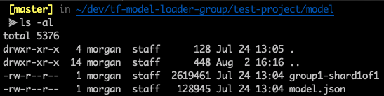
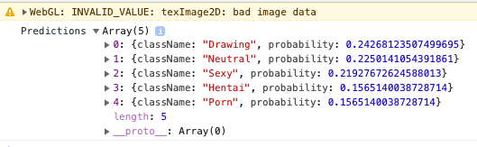

# TF Model Loader Demo

Demonstrates how to use
[tf-model-loader](https://github.com/mlaco/tf-model-loader) to ship a Tensorflow model with a JS project.

### Setup

1. Add a Tensorflow model to ./model/. Include a `model.json` and all of the shards.

2. Install dependencies, including webpack and webpack-cli

`yarn` or `npm install`

3. Compile with Webpack

`npx webpack`

This will generate `dist/main.js`. This file is referenced in `index.html`. Open `index.html` and open the console to see the output of `dist/main.js`. _(Change this so that output is immediately visible on the webpage)_

You can see that the image (defined in `index.js`) is classified as probably a drawing. It's not a drawing, but it probably classified that way because it's black-and-white.

